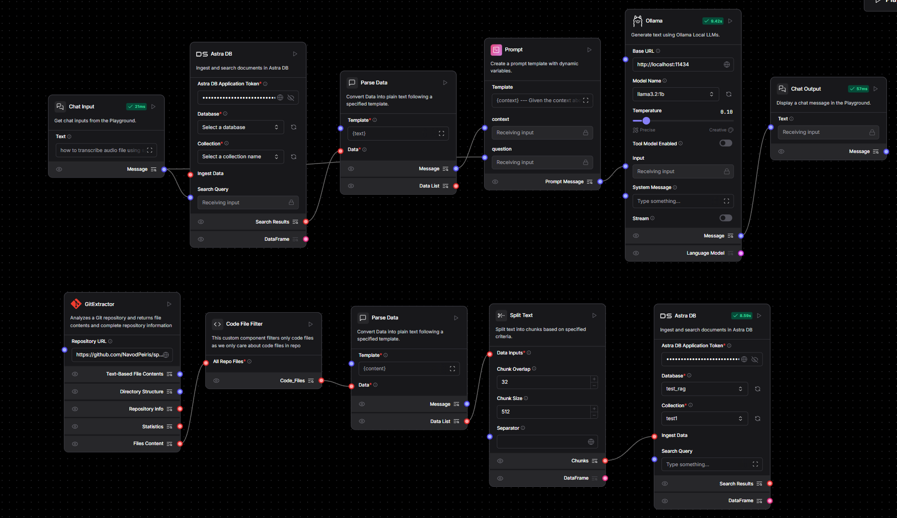

#### This repo contains JSON file downloaded from langflow project. It can be imported and used in langflow code or app.

#### Requirements:

- ollama with a LLM of your choice (codellama was used in example)
- Astra DB instance and collection
- target github repo

#### Steps:

1. download ollama and run codellama model
2. signup for Astra DB
3. setup Astra DB vector database and collection with Nvidia Embeddings enabled
4. setup Langflow and import JSON file of the flow
5. add access tokens for Astra DB components
6. run the flow!

#### Limitations:

hallucinations, incorrect retrieval cause incorrect outputs  

enjoy!

